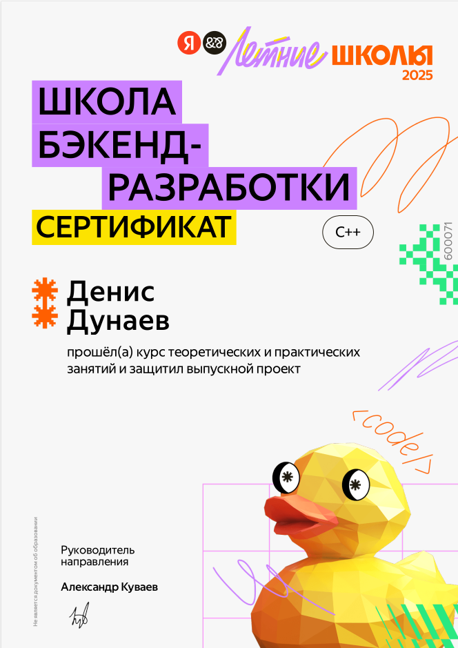

Денис Дунаев 
Студент МГТУ им Баумана 3 курс 

# Мой опыт и проекты

## Инструменты
- Git  
- CMake  
- Docker  
- Linux  
- Google Tests  
- Userver  
- CUDA  

## Опыт

- отобрался и окончил летнюю Школу Бэкенд Разработки от Яндекса
      
    [Скачать PDF с подтверждением](docs/ШБР.pdf)

- шахматный движок: [Attempt101](https://github.com/w1zZzyy/Attempt101)  
    запуск (пока что только на линуксе)
    ```bash 
    make run-desktop-release
    ```
